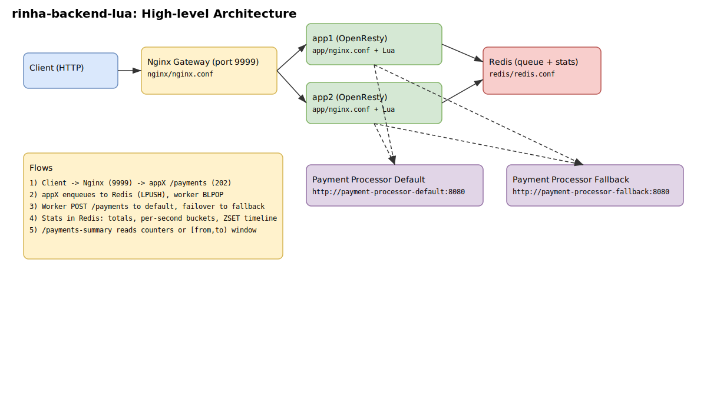

# Rinha de Backend 2025 — Lua

> Gateway de pagamentos em OpenResty/Lua com Redis. Usa processador primário e fallback, com monitoramento de saúde, fila assíncrona e sumarização.

## Arquitetura



- Stack: OpenResty/nginx + Lua, Redis, Docker
- Visão detalhada: `docs/architecture.md`

## Como rodar

```bash
# Dev
docker-compose up --build

# Produção (imagens pré‑build)
docker-compose -f docker-compose.production.yml up -d
```

- API: http://localhost:9999
- Health: http://localhost:9999/health

## Endpoints

- POST /payments — Enfileira pagamento (retorna 202)
- GET /payments-summary[?from=ISO&to=ISO] — Totais ou janela [from,to)
- POST /purge-payments — Limpa fila e métricas
- GET /health — Saúde local

## Configuração (env)

- `REDIS_HOST` (default: `redis`)
- `REDIS_PORT` (default: `6379`)
- `INSTANCE_ID` (default: `app1`)

## Scripts úteis

```bash
./build.sh       # build/push/rodar com opções
./load_test.sh   # teste de carga e métricas
```

## Observações

- Requer rede externa `payment-processor` para integrar com os processadores Default e Fallback.
- Logs de acesso desativados por performance; erros via stderr.
